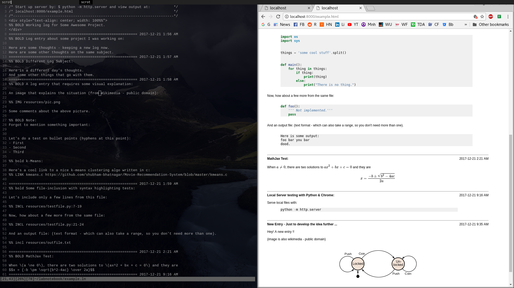

### Labnotebook

A simple working notebook that makes it easy to include text, images,
syntax-highlighted code, and math.

The input is a very basic text file with a few simple markup tags.

The output is an html file, which can easily be converted to pdf (see
`example.pdf`, above).

Markup rules can be found in the top of `labnote.py`.

#### Usage:

It's easiest to just put a makefile in your working folder, and map a key to run
`make`.

I use `<Leader> m` in Vim, and run a python file server locally, using `python
-m http.server`.

That way you can see your output file at `localhost:8000/<yourfile>.html`.

I just use a split-screen with a browser and Vim, and can therefore achieve
near-instant gratification.

#### Why not an Ipython or Jupyter notebook?

Those are both excellent solutions - but some people want something a little
simpler, that exports to different formats easily, makes nice reports if necessary, and does not
include all the `ln[1]:` line numbers for every input and output.

###### License:

This is a personal tool, in no way fit to be relied upon for any reason.  
Use it as you please, but 100% at your own risk.
