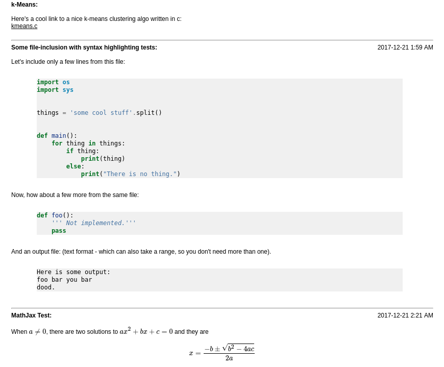

### Labnotebook

A simple working notebook that makes it easy to include text, images,
syntax-highlighted code, math, and links to reference materials.

The input is a very basic text file with a few simple markup tags.

The output is an html file, which can easily be converted to pdf (see
`example.pdf`, above).

Markup tags and rules can be found in the top of `labnote.py`.

#### Example:

The following text section includes a hyperlink, section dividers, 
some lines from a python file, and some MathJax typesetting 
(both inline and centered equations).

Note that markup tags do not have to be capitalized - the first few are capitalized
just for clarity.

```
%% BOLD k-Means:

Here's a cool link to a nice k-means clustering algo written in c:
%% LINK kmeans.c https://github.com/shubham-bhatnagar/Movie-Recommendation-System/blob/master/kmeans.c

============================================================ 2017-12-21 1:59 AM
%% BOLD Some file-inclusion with syntax highlighting tests:

Let's include only a few lines from this file:

%% INCL resources/testfile.py:7-19

Now, how about a few more from the same file:

%% INCL resources/testfile.py:21-24

And an output file: (text format - which can also take a range, so you don't need more than one).

%% incl resources/outfile.txt

============================================================ 2017-12-21 2:21 AM
%% bold MathJax Test:

When \(a \ne 0\), there are two solutions to \(ax^2 + bx + c = 0\) and they are
$$x = {-b \pm \sqrt{b^2-4ac} \over 2a}$$

```
  
Produces the following:  
  


#### Usage:

It's easiest to just put a makefile in your working folder, and map a key to run
`make`.

I use `<Leader> m` in Vim, and run a python file server locally, using `python
-m http.server`.

That way you can see your output file, including MathJax-rendered equations at `localhost:8000/<yourfile>.html`.

Using a split-screen arrangement with a browser and a text editor, you can achieve
near-instant gratification (upon reload of the browser page, anyways).


#### Why not an Ipython or Jupyter notebook?

Those are both excellent solutions - but some people want something a little
simpler, that exports to different formats easily, makes nice reports if necessary, and does not
include all the `ln[1]:` line numbers for every input and output.

#### Dependencies:

[pygments](http://pygments.org/) for syntax highlighting.

`pip install pygments`


###### License:

This is a personal tool, in no way fit to be relied upon for any reason.  
Use it as you please, but 100% at your own risk.
